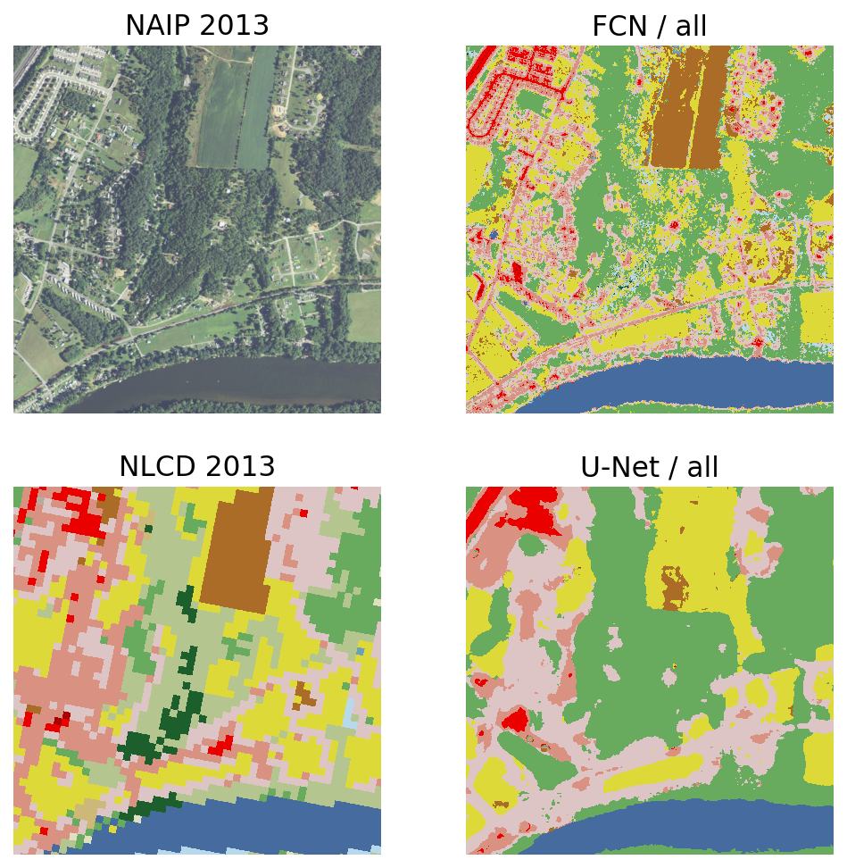

# DFC2021 MSD
This repo contains implementations of several baseline for the ["Multitemporal Semantic Change Detection" (MSD) track](http://www.grss-ieee.org/community/technical-committees/data-fusion/2021-ieee-grss-data-fusion-contest-track-msd/) of the 2021 IEEE GRSS Data Fusion Competition (DFC2021). See the [CodaLab page](https://competitions.codalab.org/competitions/27956) for more information about the competition, including the current leaderboard!    

Members: Qianyue Bao, Yang Liu, Zixiao Zhang, Dafan Chen

## Results     

- val phase  
MIou: 0.6452 Rank: 7/46   

- test phase  
MIou: 0.6445 Rank: 3/15    


## Project description
```
.
├── add_single_cls.py # Use single class classifiers for coverage
├── create_nlcd_only_baseline.py
├── data
│   ├── dfc2021_index.geojson
│   ├── dfc2021_index.txt
│   ├── splits
│   │   ├── test_inference.csv
│   │   ├── test_origin_label_radio_2.csv # Mixing high-resolution labels and low-resolution labels
│   │   ├── training_set_naip_nlcd_2013.csv
│   │   ├── training_set_naip_nlcd_2017.csv
│   │   ├── training_set_naip_nlcd_both.csv
│   │   └── val_inference_both.csv
│   ├── test_tiles.txt
│   └── val_tiles.txt
├── dataloaders
│   ├── Landsat2NlcdDatasets.py # Use Landsat8 to generate NLCD 
│   ├── Landsat2NlcdTileDatasets.py # Use Landsat8 to generate NLCD 
│   ├── StreamingDatasets.py
│   ├── TileDatasets.py
│   ├── TileMLDatasets.py # datasets for random forest model
│   └── __init__.py
├── independent_pairs_to_predictions.py
├── inference.py 
├── label_inference.py # Used to generate high-resolution pseudo-labels
├── landsat2nlcd_inference.py # Use Landsat8 to generate NLCD 
├── models.py
├── predictions_clean.py # Used to remove the noise on the change prediction map
├── rfc.py # Used to train the random forest model
├── single_class_data_maker.py # Select the data for training a single-class classifier
├── single_inference.py # Inference single class classifier
├── single_train.py # Train single class classifier
├── train.py 
├── train_landsat2nlcd.py # Use Landsat8 to generate NLCD 
├── utils.py
├── viz_utils.py
├── vote_models.py # Vote the model on the land cover classification map
└── vote_models_predictions.py # Vote the model on the change map
```

## Environment setup

The following will setup up a conda environment suitable for running the scripts in this repo:
```
conda create -n dfc2021 "python=3.8"
conda activate dfc2021
conda install pytorch torchvision cudatoolkit=10.1 -c pytorch
conda install tifffile matplotlib 
pip install rasterio fiona segmentation-models-pytorch

# optional steps to install a jupyter notebook kernel for this environment
pip install ipykernel
python -m ipykernel install --user --name dfc2021
```

## Visualizations   
<p align="center">
    
</p>


This repo is based on the [baseline](https://github.com/calebrob6/dfc2021-msd-baseline) code   

